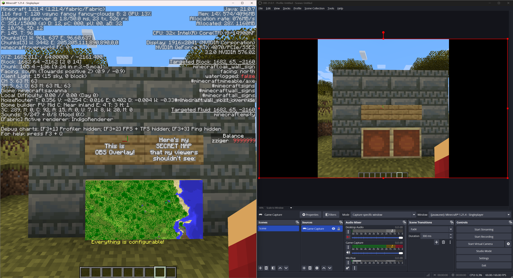
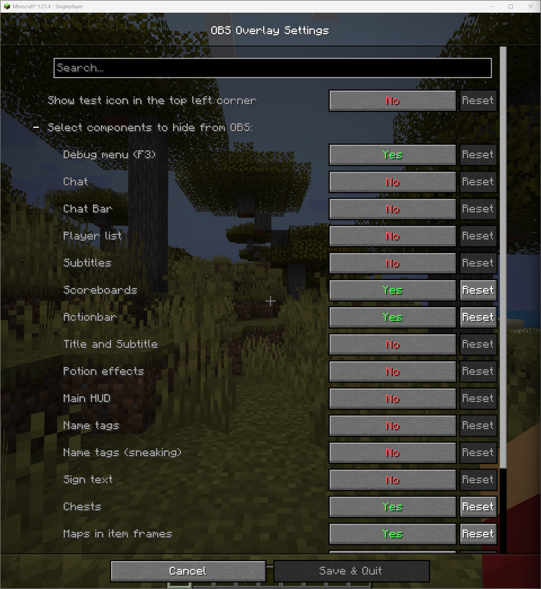

# OBS Overlay
#### Hide things from OBS stream by making them an overlay.
**[Modrinth &nearr;](https://modrinth.com/mod/obs-overlay)** • **[CurseForge &nearr;](https://www.curseforge.com/minecraft/mc-mods/obs-overlay)** • **[Got an issue?](../../issues/new)**
<br><br>
<br/>



## Installation

This mod is **client-only**.\
Supports **Windows** (x64/x86) and **Linux** (x86_64, see [Linux support](#linux-support)).

### Dependencies

- Cloth Config API
- Architectury API
- Fabric API (Fabric only)
- Mod Menu (Optional, Fabric only)

## Linux support

On Linux the game's present call is hooked the same way as on Windows, but with
different symbols and a bundled funchook-based hook library:

| Symbol(s) | Hooks |
|---|---|
| `glXSwapBuffers`, `glXSwapBuffersMscOML` (GLX) | `libGL.so.1` / `libGLX.so.0` (GLVND) |
| `eglSwapBuffers` (EGL) | `libEGL.so.1` |

To keep the HUD out of the stream, capture the game with
[obs-vkcapture](https://github.com/nowrep/obs-vkcapture) and use an OBS **Game
Capture** (vkcapture) source:

```sh
obs-gamecapture %command%    # GL + Vulkan capture helper
# or, when only Vulkan capture is needed:
env OBS_VKCAPTURE=1 %command%
```

> **Why not window/screen capture on Linux?** Window/screen capture reads the
> composited pixels the local player sees, which always include the HUD.
> obs-vkcapture's Game Capture picks up the frame *before* the overlay is drawn
> (its GL injector grabs the back buffer first, the mod's hook draws after), so
> the HUD is then excluded from the stream.

### Limitations

- **Native Vulkan renderers** (VulkanMod) are not overlayed — the overlay
  pipeline is OpenGL, same as on Windows.
- **aarch64 Linux** has no prebuilt `libMinHook.so` yet; there the native hook
  refuses to start (build it from `src/native/linux` and add
  `lib/libMinHook.linux-aarch64.so` to enable it).
- macOS is not supported.

## Features

This mod lets you hide any combination of the following components:

### In-world elements

- Text on signs
- Maps
- Chests
- Banner patterns
- Beacon

### HUD elements

- Name tags
- Debug menu (F3)
- Chat (excluding input bar)
- Chat input bar
- Player list (TAB)
- Subtitles (accessibility)
- Scoreboard
- Title and Subtitle from /title
- Actionbar from /title
- Effect display
- Main HUD (health, hunger, armor, experience, hotbar)

Additionally this mod lets you hide any combination of the following *screens*:

- Survival inventory
- Creative inventory
- Pause menu
- Command block screen
- Any HandledScreen by it's ID (e.g. `minecraft:anvil`, `minecraft:furnace`)
- All ingame screens

By default only Debug menu (F3) is hidden.

> [!WARNING]
> There is a possibility OBS might capture the HUD if started before game. If you hide any confidential information, make sure to double-check that it's not visible in the stream.<br><br>
> For additional safety you can enable test icon, which is displayed all the time and should not be visible on stream. It should let you check if the mod is working correctly.<br><br>
> **I am not responsible for any confidential information accidentally shown on stream.**

## Usage

Mod settings can be accessed by:
- Clicking `Settings` -> `Video Settings` -> `OBS Overlay settings`
- Opening mod settings through ModMenu (Fabric only)
- Opening mod settings through Mods menu (Forge only)



## API

If you want to add support for your own HUD components you can use API provided by this mod.\
Check [API documentation](API.md) for more information.

## License

[MIT](LICENSE)

The bundled Linux hook (`libMinHook.so` in `src/main/resources/lib`) statically
links [funchook](https://github.com/kubo/funchook), licensed
[GPLv2+ with a linking exception](src/native/linux/LICENSE.funchook) that permits
distribution alongside or within independently-licensed modules.