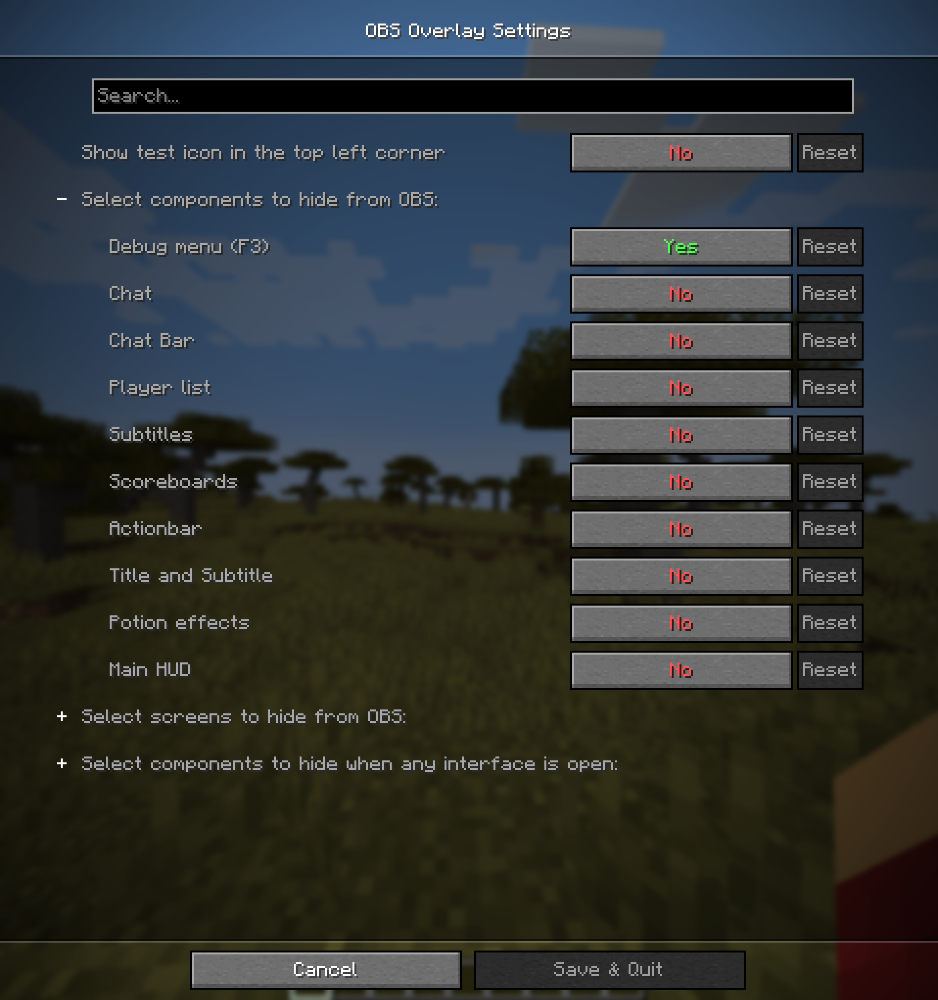

# OBS Overlay

This is a Minecraft Fabric mod that lets you hide certain HUD components from OBS game capture.

## Installation

This mod is **client-only**.\
At the moment only **Windows x64** is supported.

## Features

You can choose any combination of the following components to hide:

- Debug menu (F3)
- Chat (without input bar)
- Chat input bar
- Player list (TAB)
- Subtitles (accessibility)
- Scoreboard
- Title and Subtitle from /title
- Actionbar from /title
- Effect display
- Main HUD (health, hunger, armor, experience, hotbar)

By default only Debug menu (F3) is hidden.

> **Note:** There is a possibility OBS might capture the HUD if started before game. If you hide any confidential information, make sure to double-check that it's not visible in the stream.  
> For additional safety you can enable test icon, which is displayed all the time and should not be visible on stream. It should let you check if the mod is working correctly.  
> **I am not responsible for any confidential information shown on screen.**

## Usage

To select components to hide, enable test icon, or tweak something else you need to open mod settings.  
If you have ModMenu installed you can find them on the mod page in the menu, otherwise you should find a moonlight icon on the right upper corner of settings menu.

## License

[MIT](LICENSE)