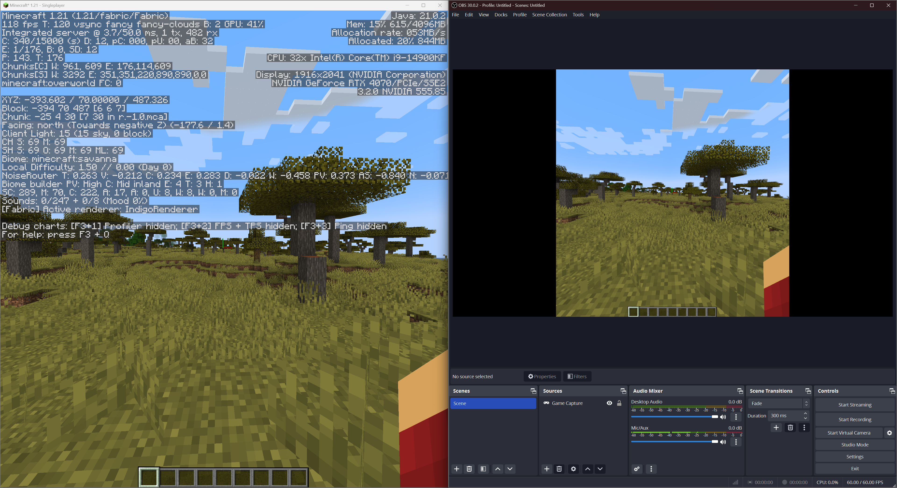

# OBS Overlay
#### Hide HUD elements from OBS stream by making them an overlay.
**[Modrinth &nearr;](https://modrinth.com/mod/obs-overlay)** • **[CurseForge &nearr;](https://www.curseforge.com/minecraft/mc-mods/obs-overlay)** • **[Got an issue?](../../issues/new)**
  
 

## Installation

This mod is **client-only**.\
At the moment only **Windows** is supported.

### Dependencies

- Cloth Config API
- Architectury API
- Fabric API (Fabric only)
- Mod Menu (Optional, Fabric only)

## Features

This mod lets you hide any combination of the following components:

- Debug menu (F3)
- Chat (without input bar)
- Chat input bar
- Player list (TAB)
- Subtitles (accessibility)
- Scoreboard
- Title and Subtitle from /title
- Actionbar from /title
- Effect display
- Main HUD (health, hunger, armor, experience, hotbar)

By default only Debug menu (F3) is hidden.

> [!WARNING]
> There is a possibility OBS might capture the HUD if started before game. If you hide any confidential information, make sure to double-check that it's not visible in the stream.  
> For additional safety you can enable test icon, which is displayed all the time and should not be visible on stream. It should let you check if the mod is working correctly.  
> **I am not responsible for any confidential information accidentally shown on stream.**

## Usage

Mod settings can be accessed by:
- Clicking `Settings` -> `Video Settings` -> `OBS Overlay settings`
- Opening mod settings through ModMenu (Fabric only)
- Opening mod settings through Mods menu (Forge only)

## API

If you want to add support for your own HUD components you can use API provided by this mod.\
Check [API documentation](API.md) for more information.

## License

[MIT](LICENSE)